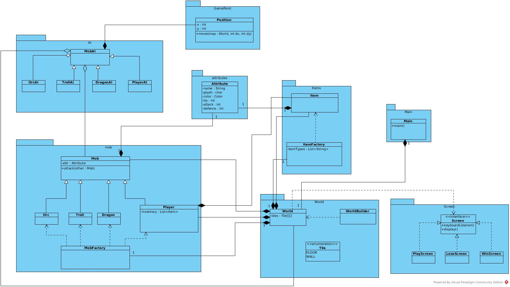
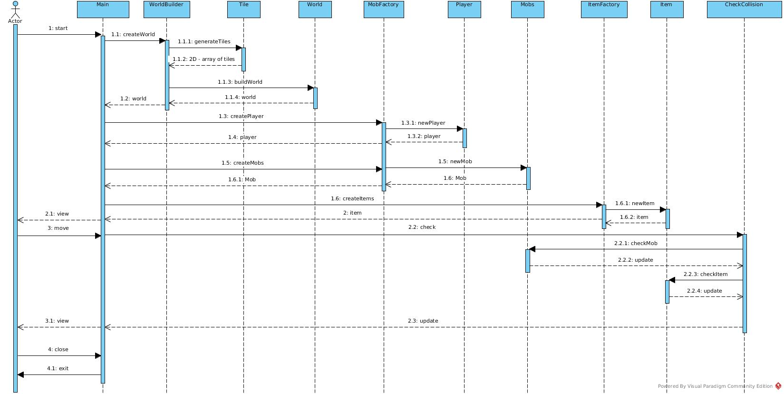
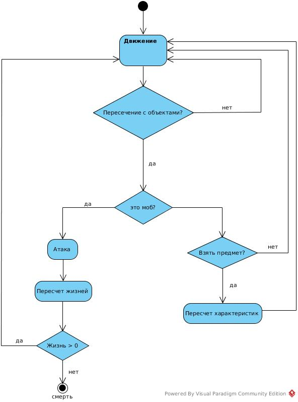

# Диздок
## Общие сведения об игре
Игра представляет собой RPG с видом сверху вниз (top - down) и управлением одним персонажем.
Жанр игры: roguelike

## Основные правила
Основное действие происходит случайно сгенерированной карте.

На карте игрок видит различные игровые объекты:

    - Главный герой - @
    - Несколько типов мобов: троль - t, орк - o, дракон - d
    - Несколько типов предметов: дополнительная жизнь - +, броня - #, атака - *

Любой игровой объект имеет жизнь, атакующую способность и броню.

Игрок управляет одним персонажем - главным героем, который может перемещаться по карте.

Задача игрока - убить всех мобов.

По пути игрок преодолевает препятствия в виде врагов - атакующих главного героя и пытающихся его убить. Игрок может подбирать предметы, лежащие на карте, которые могут увеличить его здоровье, броню, атакующую силу. Предметы можно снимать по ходу игры. При снятии она появляется в первой свободной клетке вблизи позиции игрока.

## Объекты
В игре существуют следующие объекты:
    
    - Мобы
    - Предметы
    - Объекты карты (стены)

### Мобы
Каждый моб имеет заранее заданное значение жизнеспособности, боевой и броневой навык. Жизнеспособность игрока может уменьшаться во время сражения с мобами. При подборе предмета + жизнеспособность главного героя увеличивается. Верхняя граница здоровья, брони и атакующей силы не ограничена.

### Предметы

Главный герой может собирать предметы, лежащие на карте. Предметы бывают следующих типов:

    - Здоровье - +
    - Броня - #
    - Атакующая сила - * 

Количество предметов, которое может набрать герой не ограничено. Предметы действуют на протяжении всей игры, пока герой жив.

### Правила боя и физический урон

Когда главный герой наступает на клетку, в которой находится другой персонаж, то происходит бой. Мобы(игрок тоже моб) наносят урон друг другу.
Если здоровье становится равным 0, то персонаж умирает. Игра заканчивается, когда у главного героя закончится жизнь.

## Architectural drivers
Решения, которые повлияли на архитектуру Roguelike:

    - Расширяемость состава мобов. Можно добавлять новых мобов просто наследуясь от класса Mob.
    - Также расширяемость состава предметов.
    - Способы перемещения мобов. Из - за этого и передается world (некоторые мобы могут разрушать стены).

## Роли и случаи использования
#### Пользователи:
1. Иванов Иван
    - Возраст: 12 - 16
    - Образование: начальное/основное общее образование
    - Личные качества: очень, прям очень любит играть в компьютерные игры. "Играл в компьютерные игры" уважительная причина для него не ходить в школу.
    - Особенности использования игры: запустил игру и так пропал до ночи
    - полезные фичы нашей игры для него: Генерация случайных карт каждый раз, что приводит к тому, что игра никогда не заканчивается. Следовательно Иван пропадет не да ночи а до того момента пока электричество не вырубят или не придет мама со сковородой).

2. Петрова Наталья
    - Возраст: 10 - 12
    - Образование: начальное общее образование
    - Личные качества: интересуется (не больше) компьютерными играми. Любит играть в компьютерные игры раз в неделю
    - Особенности использования игры: скачала игру поиграла минут 10 и все на сегодня.
    - полезные фичи нашей игры для нее: возможность сохранения игрового процесса, чтобы на следующей неделе могла продолжить с того же места

## Структура

* Игрок и мобы наследуются от абстрактного класса Mob. Это позволяет легко добавить в игру новые типы мобов.
* Для генерации игровых предметов используется фабрика ItemFactory. Тем самым повышается гибкость программного продукта.
* Для единообразия отрисовки и взаимодействия с клавиатурой, все экраны реализуют интерфейс Screen.
* Для реализации пользовательского интерфейса используется библиотека AsciiPanel.
* Все мобы для передвижения реализуют метод moveBy().
* Для хранения позиции и характеристик объектов используются классы Point и Attributes соответственно.

## Используемые шаблоны

**Builder** для построения игровой локации.

**Factory** для создания мобов и игровых вещей.

## Диаграмма классов

## Диаграмма последовательностей

Игра при запуске создает игровой мир при помощи класса WorldBuilder. WorldBuilder генерирует сетку карты. После конструирует класс World.

World случайным образом создает начальное количество мобов и предметов на карте используя ItemFactory и MobFactory

После того как все объекты созданы отрисовывается карта.

Далее система отслеживает ввод с клавиатуры. После ввода символа передвигается игрок и обновляются позиция и характеристики всех мобов.

Если игрок хочет перейти на клетку где находится моб, то происходит бой.
    - Если здоровье моба равно 0, то он покидает карту
    - Если здоровье игрока равно 0, то игра заканчивается.

Если игрок находится на одной клетке с предметом, то он может взять предмет нажатием кнопки *[g]*

## Диаграмма конечных автоматов

